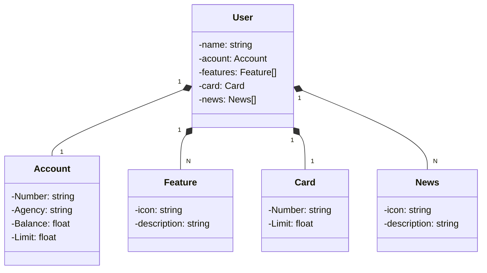

# API-REST.Santander.DIO
Java RESTful API created for Santander.DIO

## Diagram Class

## API Documentation  (Swagger)
https://api-restsantanderdio-production.up.railway.app/swagger-ui.html

This API will be available on Railway for a limited period of time, but this is open source.

Production URL: https://api-restsantanderdio-production.up.railway.app/users/1
